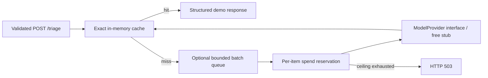

# Week 7 Capstone — Cost-Optimised Deployment & Executive Brief

**Educational demonstration only. Not medical advice, diagnosis, or a clinical service.**
A small FastAPI service demonstrates reproducible unit economics, exact response
caching, bounded batching and cost controls. It runs without paid credentials.
All application work is here; local `wk7/` classwork was inspected and left untouched.

## Rubric and evidence

| Deliverable | Marks | Evidence/location | Status |
|---|---:|---|---|
| Cost model | 20 | [Calculation and assumptions](cost/cost_model.md), cost_model.py, assumptions.json, sensitivity.py | Reproducible MODELLED scenarios |
| Deployment + budget controls | 20 | [Controls](deploy/budget_alert_notes.md), Dockerfile, Compose, AWS JSON, api/spend.py | Local validation; cloud CONFIG ONLY |
| Two optimisation levers | 25 | [Measurements](levers/measurements.md), cache_triage.py, cache_hitrate.py, batch_worker.py, tests | MEASURED with deterministic STUB |
| API vs self-host memo | 15 | [Decision memo](memo/api_vs_selfhost.md), cost_model.break_even | ESTIMATED self-host; no GPU benchmark |
| Executive brief | 20 | [One-pager](exec/executive_brief.md), printable HTML, PDF instructions | Decision with explicit conditions |

## Architecture



GET `/health` reports process health and stub identity, not upstream clinical readiness.
GET `/metrics` reports requests, errors, cache counters, provider calls/items, batches,
and **modelled** reserved/avoided dollars. JSON event logs omit message text and keys.
`ModelProvider.process_batch` is the interface. Only `StubModelProvider` is implemented;
unknown providers fail closed. No API keys are read or required. One process/worker.

## Repository structure

```text
Capstone_week7/
├── api/                 # config, request/response schema, service, spend, providers
├── cost/                # assumptions JSON, calculation, sensitivity, documentation
├── deploy/              # Dockerfile, Compose, AWS budget and notifications
├── levers/              # exact cache, hit-rate gate, batch queue, measurements
├── tests/fixtures/      # synthetic labelled contract fixture
├── tests/               # endpoint, cost, guard, cache and batch tests
├── scripts/             # staged ASGI benchmark
├── memo/                # API/self-host decision
├── exec/                # executive Markdown and printable HTML
├── evidence/            # raw measurements, verification, plan and manual checklist
├── .env.example
└── requirements.txt
.github/workflows/capstone-ci.yml  # at repository root
```

## Setup and running locally

Use Python 3.12. From the repository root:

```bash
cd Capstone_week7
python3 -m venv .venv
. .venv/bin/activate
python -m pip install -r requirements.txt
python -m uvicorn api.main:app --host 127.0.0.1 --port 8000 --workers 1
```

In a second terminal:

```bash
curl -fsS http://127.0.0.1:8000/health
curl -fsS http://127.0.0.1:8000/triage -H 'Content-Type: application/json' \
  -d '{"message":"headache demo case 01"}'
# Repeat the POST: MISS becomes HIT.
curl -fsS http://127.0.0.1:8000/metrics
```

## Environment variables

Defaults are safe; `.env` is optional and never committed. Python reads process
environment variables, **not .env automatically**. To use the supplied example:
`cp .env.example .env`, inspect it, then `set -a; . ./.env; set +a` before starting.
Compose reads `.env` when `--env-file .env` is supplied.

| Name | Default | Meaning |
|---|---|---|
| PROVIDER | stub | Only implemented provider; no paid route |
| PROVIDER_TIMEOUT | 2 | Seconds allowed for provider operation |
| CACHE_ENABLED | true | Exact response caching |
| CACHE_TTL_SECONDS | 600 | Fixed TTL, not extended by hits |
| CACHE_CAPACITY | 1024 | Maximum entries; least recently used eviction |
| BATCH_ENABLED | false | Enable queue for misses |
| MAX_BATCH_SIZE | 10 | Maximum items per batch |
| BATCH_WAIT_SECONDS | 0.005 | Collection window; total queue delay may be longer |
| QUEUE_CAPACITY | 100 | Maximum waiting items, excluding active batch |
| REQUEST_TIMEOUT | 3 | Total submit wait when batching |
| SPEND_CEILING_USD | 1 | Simulated reservation cap per process/window |
| SPEND_WINDOW_SECONDS | 3600 | Fixed window duration |
| RESERVATION_PER_ITEM_USD | 0.0001755 | Simulated cost; synchronize with revised cost assumptions |

## Tests, measurements and reproduction

Run from Capstone_week7 with the virtual environment active:

```bash
python -m pytest -q
python -m levers.cache_hitrate
python -m levers.cache_hitrate --threshold .61   # expected exit 1: prove regression gate
python -m scripts.measure --output evidence/reproduction.json
python -m cost.cost_model
python -m cost.sensitivity
```

The benchmark uses the real ASGI endpoint in-process, in waves of ten. Each
configuration begins cold. It checks urgency, advice and disclaimer on every result.
The CI runs tests, the 55% cache gate, staged quality checks and Compose validation;
see [verification](evidence/VERIFICATION.md) and [PR records](evidence/PR_NOTES.md)
for actual run status. Tests require no cloud access. The expected-failure command
above is a separate negative demonstration and is intentionally not a passing step.

## Cost model: baseline and 10× traffic

[Cost assumptions and equations](cost/cost_model.md) are the financial source of truth.
Input/output are priced separately. Monthly totals include $30 hosting/logs/egress
and four operations hours at $25/hour. These are illustrative assumptions, not quotes.

| Requests/month | Uncached total / cost per 1k | At 60% cache hits total / cost per 1k |
|---:|---:|---:|
| 100,000 | $147.55 / $1.4755 | $137.02 / $1.3702 |
| 1,000,000 (sustained 10×) | $305.50 / $0.3055 | $200.20 / $0.2002 |

At baseline, cost/request goes from $0.0014755 to $0.0013702. The hit rate is from
an artificial fixture, not a production forecast. Infrastructure held fixed does
not prove capacity at 10×. Batching is assigned no token-price discount. Actual
paid inference spend in every included measurement is zero.

## Deployment and budgets

```bash
docker compose -f deploy/docker-compose.cost.yml config --quiet
docker compose -f deploy/docker-compose.cost.yml up --build -d --wait
curl -fsS http://127.0.0.1:8000/health
docker compose -f deploy/docker-compose.cost.yml logs --no-color
docker compose -f deploy/docker-compose.cost.yml down
```

The local environment's Compose build integration may fail because buildx is missing.
The image built with the direct command below. Compose startup with published port
8000 was blocked by an existing service; an isolated Compose-run container passed
health and API checks. On a machine with port 8000 free, use:

```bash
docker build -t capstone-week7:1.0.0 -f deploy/Dockerfile .
docker compose -f deploy/docker-compose.cost.yml up --no-build -d --wait
```

The container runs without root, binds only localhost, uses a read-only filesystem,
limits CPU/memory and log size, and has a health probe. FinOps labels are project,
environment, owner and cost-centre. Cloud resources need actual cloud tags too.

[Budget notes](deploy/budget_alert_notes.md) distinguish delayed cloud alerts from
synchronous application reservations. The guard returns 503 on exhaustion and
retains reservations on errors. Cache hits can still be served. The process-local
guard resets on restart, so it is unsuitable as a global production spend cap.
AWS examples are unapplied configuration with a deliberately invalid email
placeholder. Only AWS is supplied; an Azure deployment is not claimed.

## Lever 1: exact-match cache

Only surrounding whitespace is stripped; case, internal spaces, negation and
punctuation remain distinct. SHA-256 keys include provider/contract version. TTL,
capacity and copied values prevent unbounded retention and mutation of cached
responses. In-memory fallback is the primary implementation; Redis is unnecessary.
The fixture has 40 unique messages plus 60 repeats: expected 60%, gate 55%. See
[fixture rationale](tests/fixtures/README.md). Concurrent duplicate misses can
produce duplicate calls; no single-flight claim is made. Production tenant/privacy
boundaries and medically safe reuse are future work.

## Lever 2: bounded batch queue

Queue misses, flush at maximum size or collection window, map results back to each
future, reject overload, and bound waits. Shutdown and provider failures fail callers
cleanly; subsequent batches recover. No retries or persistent job store. Completed
responses alone populate the cache. Sparse traffic can pay extra waiting time.

## Before/after results and service objective

[Recorded evidence](levers/measurements.md) contains timing methodology and raw paths.

| Configuration | Calls / processed items | Hits | p95 ms | Quality | Modelled full cost/1k |
|---|---:|---:|---:|---:|---:|
| A: baseline | 100 / 100 | 0% | 24.45 | 100/100 | $1.4755 |
| B: cache | 40 / 40 | 60% | 25.33 | 100/100 | $1.3702 |
| C: cache + batch | 4 / 40 | 60% | 25.53 | 100/100 | $1.3702 |

A→B attributes processed-item reduction to caching. B→C attributes call consolidation
to batching. Stub timings are measured, costs modelled. Demo objective: p95 ≤100ms
and ≥99% success over this 100-request test; p95 means 95% complete at or below the
threshold. One failure consumes the 1% error budget; the fixture quality gate allows
none. This is not a real-user or cloud SLO claim.

## Safety, decision and executive brief

The stub recognises a few words and otherwise requests clinician review. It can
misclassify wording and negation; it is not clinically validated. Synthetic labels
verify the software contract only. Do not put patient data in this demo. No semantic
cache, auth rebuild or frontend complexity is introduced. Do not expose it publicly
without authentication, ingress limits, privacy review and a reviewed safety design.

[API/self-host memo](memo/api_vs_selfhost.md): estimated crossing 9.32m requests/month
without cache or 23.31m with equal 60% caching; capacity is unknown. Choose a managed
API for a gated future pilot. [Executive brief](exec/executive_brief.md) and
[PDF one-pager](exec/executive_brief.pdf) and [printable HTML](exec/executive_brief.html) explain the conditional go/no-go in business
language. [PDF export](exec/PDF_INSTRUCTIONS.md) is optional and reproducible.

## Fallbacks, evidence and limitations

Free stub, in-memory cache, volatile queue and local/config-only cloud deployment are
explicit accepted fallbacks. No paid API, GPU benchmark, real clinical evaluation or
cloud alert screenshot is represented as completed. Short timing samples are not
statistical proof of a speedup. Rates are illustrative and need dated quotes. Fixed
capacity and staffing may change under load. Alert delivery and production controls
remain manual gates in the [evidence checklist](evidence/EVIDENCE_CHECKLIST.md).

Classwork reuse: token economics, people-aware break-even, TTL caching, batching and
FinOps tagging concepts were adapted from local wk7 examples. Cyclic placeholder
clinical labels, permissive quality agreement and secrets were not copied. See the
[inspection assessment](evidence/IMPLEMENTATION_PLAN.md). Repository work follows
focused commits and PRs; no classwork history was rewritten.
